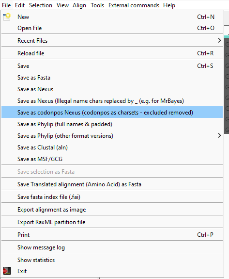

# Multiple Sequences Alignment
#### Java if you still have problems

**Check Java Installation:**

- Open the Command Prompt (`Win + R`, type `cmd`, press Enter).
- Type the following command:

```bash
java -version
```

- If Java is installed, you'll see your Java version details. Ensure it is Java 1.5 or higher.
- If Java isn't installed or your version is outdated, download the latest Java Runtime Environment (JRE) from [Oracle's official site](https://www.oracle.com/java/technologies/javase-downloads.html).

**Adding Java to PATH:**

- If Java is installed but not recognized in your command prompt, manually add it to your system PATH.
- Navigate to System Properties → Advanced → Environment Variables → System Variables.
- Add a new variable or edit the existing `Path` variable with the location typically found at:

```
C:\Program Files\Java\jre<version>\bin
```

Restart the command prompt to reflect these changes.

---

## Phyutility

- Download the latest version from [Phyutility's download page](https://code.google.com/archive/p/phyutility/downloads).
- You'll download a ZIP file containing `phyutility.jar` and possibly additional documentation or examples.

---

- Your directory structure should now look like:

```
C:\Phyutility
|-- phyutility.jar
|-- examples (optional folder)
|-- documentation (optional folder)
```

---

## Concatenate two alignments

- Open Command Prompt (`Win + R`, type `cmd`, press Enter).
- Navigate to the Phyutility directory:

```bash
cd C:\Phyutility
```

- Verify the installation by running:

```bash
java -jar phyutility.jar
```

- You should see general usage information and a list of commands available.

---

## Concatenate FASTA Files Using Phyutility

### Step 1: Prepare Your FASTA Files

- Ensure your FASTA files are **ALIGNED**. Here, we use two example files: `termites_16S_aligned.fa` and `termites_ND1_aligned.fa`.
- Move these FASTA files into your Phyutility directory (`C:\Phyutility`).

Your updated directory structure:

```
C:\Phyutility
|-- phyutility.jar
|-- termites_16S_aligned.fa
|-- termites_ND1_aligned.fa
```

### Step 2: Concatenate Files

- Run the concatenation command in the Command Prompt:
```
java -jar phyutility.jar -h concat
concatenate alignments together
options:
        -concat | designates that you want to concatenate
        -in <file name> ... | input file names
        -out <file name> | output file name
        -aa | force amino acid files
java -jar phyutility.jar -concat -in test.aln test2.aln -out testall.aln
```

```powershell
java -jar phyutility.jar -concat -in termites_16S_aligned.fa termites_ND1_aligned.fa -out termites_combined.nex -log logfile.txt
```

**Explanation:**
- `-concat`: Specifies concatenation.
- `-in`: Input files.
- `-out`: Output file name.

After execution, you'll find `termites_combined.nex` in your directory.

```
C:\Phyutility
|-- phyutility.jar
|-- termites_16S_aligned.fa
|-- termites_ND1_aligned.fa
|-- termites_combined.nex
|-- logfile.txt
```

---

## Step 5: Verify Concatenation

- To inspect the resulting file, open it with a text editor (e.g., Notepad):

```powershell
notepad termites_combined.nex
```

### Expected Output Structure:

You'll see a NEXUS-formatted file combining your sequences horizontally. Taxa missing in one alignment will have gaps (`-`). Example:

```
#NEXUS
BEGIN DATA;
	[termites_16S_aligned.fa_gene1 1-729 termites_ND1_aligned.fa_gene2 730-1217]
	DIMENSIONS NTAX=9 NCHAR=1217;
	FORMAT DATATYPE = DNA GAP = - MISSING = ?;
	MATRIX

Coptotermes_formosanus    CCTGCC...TTAGTATA
Reticulitermes_lucifugus  CCTGCC...TTGGTTTA
...
;
END;
```

Check carefully that sequences are correctly aligned and concatenated.

---

## Output File Partitioning Options

## Output File Partitioning Options

Phyutility can produce concatenated outputs in different formats useful for phylogenetic analyses:

- **NEXUS** (`.nex`): Commonly used by phylogenetic software such as PAUP*, MrBayes, and BEAST.
- **FASTA** (`.fasta` or `.fa`): Suitable for various bioinformatics tools and online platforms.

Choose the format suitable for your subsequent analyses using the `-out` option, e.g.:

```powershell
java -jar phyutility.jar -concat -in input1.fa input2.fa -out output.nex -log logfile.txt
```

---

## Troubleshooting and Additional Commands

- **Getting Help:**

```powershell
java -jar phyutility.jar -h concat
```

- **Detailed logs:**

```powershell
java -jar phyutility.jar -concat -in input1.fa input2.fa -out output.nex -log logfile.txt
```

This will produce a detailed log file (`logfile.txt`) helpful in troubleshooting issues.


## Termites_Examples
```termites_16S_aligned.fa
>Coptotermes_formosanus
CCTGCCCGCTGACTTGA-GTGTTGAAGGGCCGCGGTATTTTGACCGTGCAAAGGTAGCATAATCATTAGTTCTTTAATTGTGATCTGGAATGAATGGCTTGACGAGGCACAAGCTGTCTTAATGTTGAATGTTTTATTGAATTTGGTTTTTGAGTTAAAATTCTTAGATGTTTTTGTGGGACGAGAAGACCCTATAGAGTTTAACATTTGGTTTATTTGTTTGTTTGTTGTTTGTTTGTTTTATTGGTGAGT------GGACTTTT-----TGTTTTGTTGGGGTGATGGGAGGAATA-TAATTAACTCCTCTTGATTTTGGTTATATTGATTTATATTTATTTGATCCATTTATTTTGATTATAAGATTAAATTACCTTAGGGATAACAGCGTTATCTTCCTTGAGAGTTCTTATCGGCAGGGAGGTTTGCGACCTCGATGTTGGATTAAGGTGAATTTTTGGTGTAGGGGCTGAAAGTTATTATTGGGTCTGTTCGACCTTTAAAATCTTACATGATCTGAGTTCAAACCGGCGTGAGCCAGGTTGGTTTCTATCTATAAATGTAATTTTATACCTTAGTACGAGAGGACCAGGTATTTGGAATAATTTTGTTGTTGTTGAGTTTTATTAACTGGCTATTTTGGCAGATAAGTGCGCTGGATTTAGAATCTATTAATGTGAAGTTT--ATTTTACAAGTAGTATTTGTTATGTTGGG---ATTATTT
>Reticulitermes_lucifugus
CCTGCCCGCTGACTTTG-ATGTTGAAGGGCCGCGGTATTTTGACCGTGCAAAGGTAGCATAGTCATTAGTTCTTTAATTGTGATCTGGTATGAATGGCTTGACGAGGCATGGGCTGTCTTAATTTTGAATTGTTTATTGAATTTGGTTTTTGAGTTAAAATTCTTAGATGTTTTTATGGGACGAGAAGACCCTATAGAGTTTAACATTTA--TT-ACGGTTC-TTTTCTGTTTGT-----------GAGGGTTCGCT-GGGCCGTTTAGTATGTTTCGTTGGGGTGATGGGAGGGATT-TATTTAACCCCTCCTTTATGTTGTTATATTTATTTATATTTATTTGATCCATTTATTTTGATTGTAAGATTAAGTTACCTTAGGGATAACAGCGTTATCCCCCTTGAGAGTTCTTATCGGCAGGGGGGTTTGCGACCTCGATGTTGGATTAAGATTTATTTTCGGTGTAGGGGCTGGAAGT---TATTAGGTCTGTTCGACCTTTAAAATCTTACATGATCTGAGTTCAAACCGGCGTGAGCCAGGTTGGTTTCTATCTAT-AAAGGAGTTTTATACCTTAGTACGAGAGGACCAGGTATTTGGAATAATTTTATTTTTGTTGATTATTATTAACTGGCTATTTTGGCAGATAAGTGCGTTAGATTTAGAATCTGTTAATGTAAATTTTTAATGTTACAAGTAGTA-----TATGTTGGGTTATTTATTT
>Reticulitermes_grassei
CCTGCCCACTGAC--TG-GTGTTGAAGGGCCGCGGTATTTTGACCGTGCAAAGGTAGCATAATCATTAGTTCTTTAATTGTGATCTGGTATGAATGGCTTGACGAGGCATGGGCTGTCTTAATTTTGAATTGTTTGTTGAATTTGTTCTTTGAGTTAAAATTCTTAGATGTTTTTATGGGACGAGAAGACCCTATAGAGTTTAACATTTA--TT-ATGGTCCTTTTTCTGTTTGT-----------GAGGGTTCACT-GGGCCGTTTAATATGTTTTGTTGGGGTGATGGGAGGGATT-TATTTAACCCCTCCTTTGTGTTGTTATATTTATTTATATTTACTTGATCCATTTATTTTGATTGTAAGATTAAATTACCTTAGGGATAACAGCGTTATCCCCCTTGAGAGTTCTTATCGGCAGGGGGGTTTGCGACCTCGATGTTGGATTAAGGTTTATTTTCGGTGTAGTGGCTGAAAT----TATTAGGTCTGTTCGACCTTTAAAATCTTACATGATCTGAGTTCAAACCGGCGTGAGCCAGGTTGGTTTCTATCTAT-AATGGAGTTATATATCTTAGTACGAGAGGACCAGATATTTGGAATAATTTTATGTTGGTTGAATATTATTAACTGGCTATTTTGGCAGACAAGTGCGTTAGATTTAGAATCTGTTAATGTAAATTTTTAATGTTACAAGTAGTA-----TGTGTTGGGTTATTTATTT
>Reticulitermes_chinensis
CCTGCCCGCTGACTTTA-GTGTTGAAGGGCCGCGGTATTTTGACCGTGCAAAGGTAGCATAGTCATTAGTTCTTTAATTGTGATCTGGTATGAATGGCTTGACGAGGCATGGGCTGTCTTAATTTTTAATTGTTTATTGAATTTGGTCTTTGAGTTAAAATTCTTAGATGTTTTTATGGGACGAGAAGACCCTATAGAGTTTAACATTTG--TT-ATGGTCCCCTTTCTGTTTGT-----------GAGGGTTCATT-GGGCCGTTTAATATGTTTTGTTGGGGTGATGGGAGGGATT-AATTTAACCCCTCCTTTTTATTATTATATTTATTTATATTTACTTGATCCATTTATTTTGATTGTAAGATTAAATTACCTTAGGGATAACAGCGTTATCTTCCTTGAGAGTTCTTATCGGCAGGGGGGTTTGCGACCTCGATGTTGGATTAAGGTTTATTTTCGGTGTAGGGGCTGAAAAT---TATTAGGTCTGTTCGACCTTTAAAATCTTACATGATCTGAGTTCAAACCGGCGTGAGCCAGGTTGGTTTCTATCTAT-AATGGAGTTTTATACCTTAGTACGAGAGGACCAGGTATTTGGAATAATTTTATGTTTGTTGAATATTATTAACTGGCTATTTTGGCAGATAAGCGCGTTAGATTTAGAATCTGTTAATGTAAATTTTTAATGTTACAAGTAGTATT--ATATGTTGGGTTATTTGTTT
>Reticulitermes_flaviceps
CCTGCCCGCTGACTTTA-GTGTTGAAGGGCCGCGGTATTTTGACCGTGCAAAGGTAGCATAGTCATTAGTTCTTTAATTGTGATCTGGTATGAATGGCTTGACGAGGCATGGGCTGTCTTAATTTTGAATTGTTTATTGAATTTGGTCTTTGAGTTAAAATTCTTAGATGTTTTTATGGGACGAGAAGACCCTATAGAGTTTAACATTTG--TT-ATGGTCCCCTTTCTGTTTGT-----------GAGGGTTCATT-GGGCCGTTTAATATGTTTTGTTGGGGTGATGGGAGGGATT-AATTTAACCCCTCCTTTTTATTATTATATTTATTTATATTTACTTGATCCATTTATTTTGATTGTAAGATTAAATTACCTTAGGGATAACAGCGTTATCTTCCTTGAGAGTTCTTATCGGCAGGGGGGTTTGCGACCTCGATGTTGGATTAAGGTTTATTTTCGGTGTAGGGGCTGAAAAT---TATTAGGTCTGTTCGACCTTTAAAATCTTACATGATCTGAGTTCAAACCGGCGTGAGCCAGGTTGGTTTCTATCTAT-AATGGAGTTTTATACCTTAGTACGAGAGGACCAGGTATTTGGAATAATTTTATGTTTGTTGAATATTATTAACTGGCTATTTTGGCAGATAAGTGCGTTAGATTTAGAATCTGTTAATGTAAATTTTTAATGTTACAAGTAGTATT--ATATGTTGGGTTATTTGTTT
>Reticulitermes_urbis
CCTGCCCGCTGAC-TTG-GTGTTGAAGGGCCGCGGTATTTTGACCGTGCAAAGGTAGCATAGTCATTAGTTCTTTAATTGTGATCTGGTATGAATGGCTTGACGAGGCATGGGCTGTCTTAATTTTGAATTGTTTATTGAATTTGGTCTTTGAGTTAAAATTCTTAGATGTTTTTATGGGACGAGAAGACCCTATAGAGTTTAACATTTA--TT-ATGGTCC-TTTTCTGTTTGT-----------GAGGGTTCACT-GGGCTATCTAATATGTTTTGTTGGGGTGATAGGAGGGATT-AATTTAACCCCTCCTTTTTGTTGTTATATTTATTTATATTTACTTGATCCATTTATTTTGATTGTAAGATTAAATTACCTTAGGGATAACAGCGTTATCTTCCTTGAGAGTTCTTATCGGCAGGGGGGTTTGCGACCTCGATGTTGGATTAAGGTTTATTTTCGGTGTAGGGGCTGGAAAT---TATTAGGTCTGTTCGACCTTTAAAATCTTACATGATCTGAGTTCAAACCGGCGTGAGCCAGGTTGGTTTCTATCTAT-AATGGAGTTTTATACCTTAGTACGAGAGGACCAGGTATTTGGAATAATTTTATATTTGTTGAATATTATTAACTGGCTATTTTGGCAGATAAGTGCGTTAGATTTAGAATCTGTTAATGTAAATTTTTAATGTTACAAGTAGTATT--ATATGTTGGGTTATTTATTT
>Reticulitermes_balkanensis
CCTGCCCGCTGACTTTG-GTGTTGAAGGGCCGCGGTATTTTGACCGTGCAAAGGTAGCATAGTCATTAGTTCTTTAATTGTGATCTGGTATGAATGGCTTGACGAGGCATGGGCTGTCTTAATTTTGAATTATTTATTGAATTTGGTCTTTGAGTTAAAATTCTTAGATGTTTTTATGGGACGAGAAGACCCTATAGAGTTTAACATTTA--TT-ATGGTCCTTTTTCTGTTTGT-----------GAGGGTTCACT-GGGCTGTCTAATATGTTTTGTTGGGGTGATGGGAGGGATTAAATTTAACCCCTCCTTTTTATTATTATATTTATTTATATTTACTTGATCCATTTATTTTGATTGTAAGATTAAATTACCTTAGGGATAACAGCGTTATCTTCCTAGAGAGTTCTTATCGGCAGGGGGGTTTGCGACCTCGATGTTGGATTAAGGTTTATTTTCGGTGTAGGAGCTGAAAT----TATTAGGTCTGTTCGACCTTTAAAATCTTACATGATCTGAGTTCAAACCGGCGTGAGCCAGGTTGGTTTCTATCTAT-AATGGAGTTTTATACCTTAGTACGAGAGGACCAGGTATTTGGAATAATTTTATATTTGTTGAATGTTATTAACTGGCTATTTTGGCAGATAAGTGCGTTAGATTTAGAATCTGTTAATGTAAATTTTTAATGTTACAAGTAGTATT--ATATGTTGGGTTATTTGTTT
>Reticulitermes_virginicus
CCTGCCCGCTGACTTTG-GTGTTGAAGGGCCGCGGTATTTTGACCGTGCAAAGGTAGCATAGTCATTAGTTCTTTAATTGTGATCTGGTATGAATGGCTTGACGAGGCATGGGCTGTCTTAATTTTAAATTGCTTATTGAATTTGGTCTTTGAGTTAAAATTCTTAGATGTTTTTATGGGACGAGAAGACCCTATAGAGTTTGACATTTA--TT-ATGGTCT-CTTTCTGTTTGT-----------GAGGGTTCACT-GGGCCATTTAATATGTTTTGTTGGGGTGATGGGAGGGATATAATTTAACCCCTCCTTTGTGTTGTTATATTTATTTATATTTGTTTGATCCATTTATTTTGATTGTAAGATTAAATTACCTTAGGGATAACAGCGTTATCCCCCTTGAGAGTTCTTATCGGCAGGGGGGTTTGCGACCTCGATGTTGGATTAAGGTTAATTTTCGGTGTAGGGGCTGAAGTTA--TATTGGGTCTGTTCGACCTTTAAAACCTTACATGATCTGAGTTCAAACCGGCGTGAGCCAGGTTGGTTTCTATCTAT-AATGGAGTTTTATACCTTAGTACGAGAGGACCAGGTATTTGGAATAATTTTATGTTTGTTGAATATTATTAACTGGCTATTTTGGCAGATAAGTGCGTTAGATTTAGAATCTGTTAATGTAAATTTTTAATGTTACAAGTAGTAT---GTATGTTGAGTTATTTATTT
>Reticulitermes_flavipes
CCTGCCCACTGACCTTGAATGTTGAAGGGCCGCGGTATTTTGACCGTGCAAAGGTAGCATAGTCATTAGTTCTTTAATTGTGATCTGGTATGAATGGCTTGACGAGGCATAGGCTGTCTTAATTTTGAATTGTTTATTGAATTTGGTCTTTGAGTTAAAATTCTTAGATGTTTTTATGGGACGAGAAGACCCTATAGAGTTTGACATTTA--TTCACGGTCT-CTTTCTGTTTGT-----------GAGGGTTCACTAGGGCTGTTTAATATGTTTTGTTGGGGTGATGGGAGGGATATTATTTAACCCCTCCTTTGTGTTGTTATATTTATTTATATTTGCTTGATCCATTTATTTTGATTGTAAGATTAAATTACCTTAGGGATAACAGCGTTATCTCCCTTGAGAGTTCTTATCGGCAGGGGGGTTTGCGACCTCGATGTTGGATTAAGGTTTATTTTCGGTGTAGGGGCTGGAAAGTTATATTGGGTCTGTTCGACCTTTAAAATCTTACATGATCTGAGTTCAAACCGGCGTGAGCCAGGTTGGTTTCTATCTAT-AATGGA-TTTTATACCTTAGTACGAGAGGACCAGGTATTTGGAATAATTTTATGTTTGTTGAATATTATTAACTGGCTATTTTGGCAGATAAGTGCGTTAGATTTAGAATCTGTTAATGTAAATTTTTAATGTTACAAGTAGTAT---ATATGTTGGGTTATTTATTT
```
```termites_ND1_aligned.fa
>Reticulitermes_urbis
TTTATTGTGGTCTTTTTGTTGTTGATTTTGTTTGTCATGGTTGGTGTAGCCTTTCTTACTCTTTTGGAACGGAGGGTTTTGGGATATGTTCATATTCGCAGGGGCCCGAATAGGGTAGGATTTGTTGGTGTTCTTCAGCCTTTTAGAGATGCCATTAGGTTGTTTTCTAAGGAGCAGTATTTTCCTTTGGTTTCTAATTATCTGGTTTATTATTTTTCTCCTGTTTTTGGTTTATTCCTTTCATTGTTGGTTTGACTGTTGATCCCTTATTTAAGAGGTTTTGTTTCCTTTGAGTTAGGCTTATTATTTTTTTTGGCATGTACTAGATTGGGTGTTTATACTGTAATAGTTGCTGGTTGGTCTTCTAATTCTAGATATTCTTTATTGGGTGGTTTGCGTGCTTTGGCTCAGACTGTTTCTTATGAGGTAAGATTAGCCTTTATCTTGTTTTCTTTTGTTATTTTGATTTGTAGTTATAATCTAGTTTA
>Reticulitermes_balkanensis
TTTGTCGTAGTCTTTTTGTTGTTGATCTTGTTTGTCATGGTTGGTGTGGCCTTTCTTACTCTTTTGGAACGAAGGGTTTTGGGTTATGTTCATATTCGTAGGGGTCCTAATAGGGTGGGATTTGTTGGTGTTCTTCAGCCTTTTAGAGATGCCATTAGGTTATTTTCTAGGGAGCAATATTTTCCTTTGGTTTCTAATTATCTGGTTTATTATTTTTCTCCTGTTTTTGGTCTATTTCTTTCATTATTGGTTTGGCTGTTGATTCCTTATTTGAGAGGTTTTGTTTCTTTTGAGTTGGGCTTGTTATTTTTTTTGGCTTGTACTAGCTTGGGTGTTTATACTGTAATAGTTGCTGGTTGGTCTTCTAATTCTAGATATTCTTTATTGGGTGGTTTGCGTGCTTTGGCTCAGACTGTTTCCTATGAGGTAAGATTAGCCTTTATTTTGTTTTCTTTTGTTATTTTGATTTGTAGCTATAATCTGGTTTA
>Reticulitermes_lucifugus
TTCGTTGTGGTCTTTTTGTTGTTGATTTTATTTGTCATGGTTGGTGTAGCTTTTCTTACCCTTTTGGAACGGAAGGTTTTAGGTTATGTTCATATCCGCAGGGGCCCGAATAGGGTGGGATTTGTTGGTGTTCTTCAGCCTTTTAGAGATGCAATTAGGCTGTTTTCTAGGGAGCAGTATTTTCCTTTGGTTTCTAATTATTTGGTTTATTATTTTTCTCCTATTTTTGGTTTGTTCCTTTCTTTGTTGGTTTGGTTGTTGATCCCTTATTTGAGAGGTTTTATTTCCTTTGAATTGGGTTTATTATTTTTTTTGGCTTGTACTAGATTGGGTGTTTATACTGTAATGATTGCTGGTTGGTCTTCTAATTCTAGATATTCTTTATTGGGTGGTTTACGTGCTTTGGCTCAGACTATTTCTTATGAGGTAAGATTGGCCTTTATTTTATTTTCTTTTGTTATTTTGATTTATAGTTATAATTTGGTTTA
>Reticulitermes_grassei
TTTGTTGTAGTCTTTTTGTTGTTGATTTTGTTTGTCATGGTTGGTGTAGCTTTTCTTACCCTTTTGGAACGGAGGGTTTTAGGTTATGTTCATATTCGCAGGGGCCCGAATAGGGTAGGATTTGTTGGTGTTCTTCAGCCTTTTAGAGATGCCATTAAGTTGTTTTCTAGGGAGCAATACTTTCCTTTGGTTTCTAATTATTTGGTTTATTATTTTTCTCCTGTTTTTGGTTTATTTCTTTCTTTGTTGGTTTGGTTGTTGATTCCTTATTTGAGAGGTTTTATTTCCTTTGAGTTGGGTTTATTATTTTTTTTGGCTTGTACCAGATTGGGTGTTTATACTGTGATGATTGCTGGCTGGTCTTCTAATTCTAGATATTCTTTATTGGGTGGTTTGCGTGCTTTGGCTCAGACTATTTCTTATGAGGTAAGATTGGCCTTTATTTTATTTTCTTTTGTTATTTTGATTTATAGTTATAATTTAGTTTA
>Reticulitermes_virginicus
TTTGTTGTAATTTTTTTGCTGTTAATTTTGTTTGTTCTGGTTGGTGTGGCTTTTCTTACTCTTTTAGAGCGGAGGGTTTTGGGTTATGTTCACATTCGAAGGGGTCCAAATAAGGTAGGGTTTGTTGGAGTTCTTCAACCTTTTAGAGATGCTATTAAGTTATTTTCTAGGGAGCAGTCTTTTCCTTTGGTTTCTAATTACTTAGTTTATTATTTTTCTCCTGTCTTCGGCTTATTCCTTTCTTTATTGGTTTGGTTGTTGATTCCTTATTTGAGAGGGTTTATTTCATTTGAGTTGGGTTTATTATTTTTTTTGGCTTGTACTAGATTGGGCGTTTATACTGTAATGGTTGCTGGTTGGTCTTCTAATTCTAGATACTCTTTATTGGGGGCTTTACGTGCTTTGGCTCAGACTATTTCTTATGAGGTAAGATTGGCCTTTATTTTGTTTTCTTTTGTTATTTTGATTTGTAGTTATAATTTGATTTA
>Reticulitermes_flavipes
TTTGTTGTAGTTTTTTTGTTGTTGATTTTGTTTGTTTTGGTTGGTGTCGCCTTTCTTACTCTTTTAGAACGGAGGGTTTTAGGTTATGTTCATATTCGAAAGGGTCCGAATAGGGTAGGATTTGTTGGTATTCTCCAACCTTTTAGAGATGCCATTAAGTTATTTTCTAGGGAGCAATATTTTCCTTTATTTTCTAATTATTTGGTTTATTATTTTTCTCCTGTCTTTGGTTTATTCCTTTCTTTGTTGGTTTGGTTGTTAATTCCTTATTTGAGAGGTTTTATTTCCTTTGAGTTGGGGTTATTGTTTTTTTTGGCTTGTACTAGATTGGGTGTTTATACTGTAATGGTTGCTGGTTGGTCTTCTAATTCTAGATATTCTTTATTGGGTGGCTTGCGTGCTTTGGCTCAGACCATTTCTTATGAGGTAAGATTAGCTTTTATTTTGTTTTCTTTTGTTATTTTGATTTGTAGTTATAATTTGGTTTA
>Reticulitermes_chinensis
TTTGTTGTGGTCTTTTTGTTGTTGATTTTGTTTGTCATGGTTGGCGTGGCCTTTCTTACTCTTTTGGAACGTAGGGTTTTGGGTTATGTTCATATTCGGAAGGGTCCAAATAGGGTAGGATTTGTTGGTGTTCTTCAGCCTTTTAGAGATGCCATTAGGTTATTTTCTAGGGAGCAGTATTTTCCTTTGGTTTCTAATTATTTGGTTTATTATTTTTCTCCTGTTTTTGGTTTACTTCTTTCTTTGTTAGTCTGGTTATTAATTCCTTATTTGAGAGGATTTATTTCCTTTGAGTTGGGCTTGTTGTTTTTTTTGGCTTGTACTAGATTAGGTGTTTATACTGTAATAGTTGCTGGTTGGTCTTCTAATTCTGGGTATTCTTTATTGGGGGGTTTGCGTGCTTTGGCTCAGACTGTTTCTTATGAGGTAAGATTGGCCTTTATTTTATTTTCTTTTGTTATTTTGATTTGTAGTTATAATCTAATTTA
>Reticulitermes_flaviceps
TTTGTTGTGGTCTTTTTGTTGTTGATTTTGTTTGTCATGGTTGGCGTGGCCTTTCTTACTCTTTTGGAACGTAGGGTTTTGGGTTATGTTCATATTCGGAAGGGTCCAAATAGGGTAGGATTTGTTGGTGTTCTTCAGCCTTTTAGAGATGCCATTAGGTTATTTTCTAGGGAGCAGTATTTTCCTTTGGTTTCTAATTATTTGGTTTATTATTTTTCTCCTGTTTTTGGTTTATTTCTTTCTTTGTTAGTCTGGTTATTAATTCCTTATTTGAGAGGATTTATTTCCTTTGAGTTGGGCTTGTTGTTTTTTTTGGCTTGTACTAGATTAGGTGTTTATACTGTAATAGTTGCTGGTTGGTCTTCTAATTCCGGGTATTCTTTATTAGGTGGTTTGCGTGCTTTGGCTCAGACTGTTTCCTATGAGGTAAGATTAGCCTTTATTTTATTTTCTTTTGTTATTTTGATTTGTAGTTATAATCTAATTTA
>Coptotermes_formosanus
TCTATTGTTGTGTTTTTGTTGTTGGTTATTTTTGTTTTAGTTGGGGTGGCATTTCTTACTCTTTTAGAACGTAGGGTTTTAGGTTATATTCATATTCGTAAGGGCCCCAATAAGGTTGGGTTTGTTGGTATTCTTCAGCCTTTTAGAGATGCTATCAGGTTGTTCTCTAGGGAGCAGTATTTTCCTCTGGTTTCTAATTATTTGGTTTATTATTTTTCTCCTGTGTTTGCTTTATTTCTTTCTTTGTTGATTTGGTTATTGGTTCCTTATTTAAGAGGTTTCATTTCTTTTGAGTTGGGTTTATTGTTTTTTCTGGCCTGTACTAGACTTGGTGTTTATACTGTTATGATTGCTGGTTGGTCATCTAATTCTGGTTATTCTTTGTTAGGTGGGCTTCGTGCTTTGGCTCAGACTATCTCTTATGAAGTTAGATTGGCTTTTATTTTGTTTTCTTTTGTTGTTTTAGTTTGTAGTTATAATTTAGTATA
```

## Concatenation Examples
### Vertebrata dataset
Open the three multifasta files, align them and use phyutility to concatenate them 
`java -jar phyutility.jar -concat -in .\COX1_aligned.fasta .\CYTB_aligned.fasta .\ND4_aligned.fasta -out concatenated_output.nex`
Now you can try with different markers for different (non completely overlapping) datasets as nexus format. You'll have to export the alignments (it means checking the alignments, the reading frames and the number of species which actually contain sequences) as fasta files and finally concatenate them
`java -jar phyutility.jar -concat -in .\psaA.fas .\psaB.fas .\rpoB.fas .\rpoC1.fas .\ycf2.fas -out concatenated_output.nex`

# Codon partitioning in AliView
`File > Save as codonopos Nexus`

AliView will cluster all First, Second and Third codon positions in an alignment like it's a normal sequence (**remember it is not**) using a colour code for each position and creating a `.nex` file      

Opening the nexus file will reveal a snippet of code at the end, basically a charset/partition like this:
```
BEGIN SETS;
charset 1st = 1-243; # All First codon nucleotides are found from position 1 to position 243 
charset 2nd = 244-486; # All Second codon nucleotides positions
charset 3nd = 487-729; # All Third codon nucleotides positions
END;
```
**Remember that you are looking at "fake" sequences (i.e. not within the variability of the gene you have extracted them from)**
So if you reopen the same file forgetting it is indeed a codon position partition you can easily mistake it for the sequence you created it from (in AliView)
